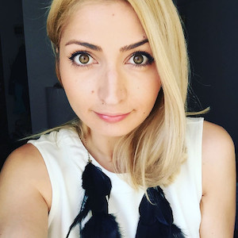

# vasile
## Vasile - Local Guide for Internationals (ghid local pentru internationali)

## Obiective

> [Demo](_<Presentation Video link>_)

### Produs

* **P0**: Utilizatorul poate afla informatii de interes (legislativ, urban, administrativ, etc.).
* **P0**: Utilizatorul poate descoperi locatii din zona in care locuieste (restaurante, teatre, magazine, farmacii, etc.) - descoperit pe baza de Geolocation / inputul utilizatorului.
* **P0**: Utilizatorul poate auzi expresii / formulari citite in romaneste si inregistrate ca voice over / fond sonor in aplicatie.
* **P0**: Utilizatorul acceseaza continutul intr-o forma intuitiva, bazata pe taxonomii eficiente (P1: eventual actualizabile in functie de pattern-urile de utilizare ale aplicatiei).
* **P0**: Aplicatia este distractiva de utilizat: sectiuni “surpriza” cu injuraturi, proverbe celebre, dume audio ale celebritatilor ( Vadim, Hagi, etc.)
* **P0**: Utilizatorul poate folosi (intuitiv si usor) aplicatia pentru a afla:
  * _Ce sa manance azi?_
  * _Unde poate vedea un film?_
  * _Unde poate ajunge la o farmacie?_
  * _Unde poate ajunge la un magazin alimentar?_
  * _Unde poate ajunge sa plateasca taxe?_
* **P1**: Utilizatorul poate conecta un canal de Youtube la aplicatie unde poate asculta muzica / tutoriale / etc. facute de romani (preferabil cu subtitrari in engleza).
* **P1**: Aplicatia este educativa - utilizatorul poate inregistra expresiile care sunt auzite, si un algoritm poate masura similaritatea pronuntiei.
* **P1**: Utilizatorul isi poate conecta contul de social media (Facebook, Instagram, etc.) si sa primeasca sugestii ale unui AI colectiv al cercurilor sale sociale (prieteni, familie, grupuri de prieteni, comunitati, etc.)

### Prototip 2021.11.27 DevFest

* Un UX mock functional cu primele 1' - 2' cu user flow-ul unui user si taxonomii statice.
* Insa cu mare parte din artefactele si UX-ul produsului final
* Dpdv documentatie, o 'coloana vertebrala' pe care se poate construi in paralel pe diverse directii de implementare / cercetare.

## Beneficii

### End-user value

* Utilizatorul il poate folosi pe Vasile si cunostintele personale de limba engleza pentru a se descurca in Romania, si pentru a invata limba romana.
* Utilizatorul se distreaza si se destinde cand foloseste aplicatia.
* Utilizatorul foloseste aplicatia ca interfata intre sine si localnici romani.

### Potential de inovatie

* Vasile creste spre un AI care foloseste tehnici de ML, etc. pentru a invata journey-urile utilizatorului, rutinele de zi cu zi, si se poate integra natural (prin notificari, etc.) in viata utilizatorului.
* Vasile foloseste servicii de traducere si text to voice pentru a traduce inputul utilizatorul (text, engleza) in raspunsuri relevante semantic in audio, romana. Se poate studia / cerceta si pe partea de procesare a limbajului natural.
* Vasile foloseste servicii de calendar, timere, liste de cumparaturi, etc., similar unui asistent de tip Google Assistant sau Alexa (poate chiar ei),  pentru a oferi sugestii personalizate si familiare, in limba romana.
* Vasile foloseste servicii audio, si devine un asistent in ambianta auditiva a utilizatorului, care ii ofera muzica romaneasca (in functiile de gusturile utilizatorului), sugestii de posturi de Radio romanesti (Rock FM, Guerilla, Tananana), programe la Opera Romana, Teatrul de Comedie - in functie de orasul utilizatorului.
* Vasile devine un membru distractiv al intregului grup de cunostinte ale expatului in Romania, putand sa faciliteze interactiunea cu localnicii, sau fiind un instrument educativ in discutiile cu alti expati.

## [Detalii tehnice](docs/technical.md)

## Team

#### **Eugeniu Cernei**
##### Machine Learning Engineer, Heimdal Security

#### **Bogdan Purcareata**
##### Senior Software Engineer, Google

### Special thanks:
,
#### **Roxana Neagu**
##### Director Editorial [avocatnet.ro](https://avocatnet.ro/)

#### **Mihai Dinu**
##### Software Engineer, HARMAN International

#### **Remus Popovici**
##### Co-Founder, [R&R Partners Bucharest](https://rrpb.ro/home-page/)

#### Credits
* [https://github.com/dodgerblue/vasile](https://github.com/dodgerblue/vasile)
* Produced by: 6-BlueTeam
* Music:
  * Subcarpati - Balada Romanului
  * Zdob si Zdub - Videli Noch
