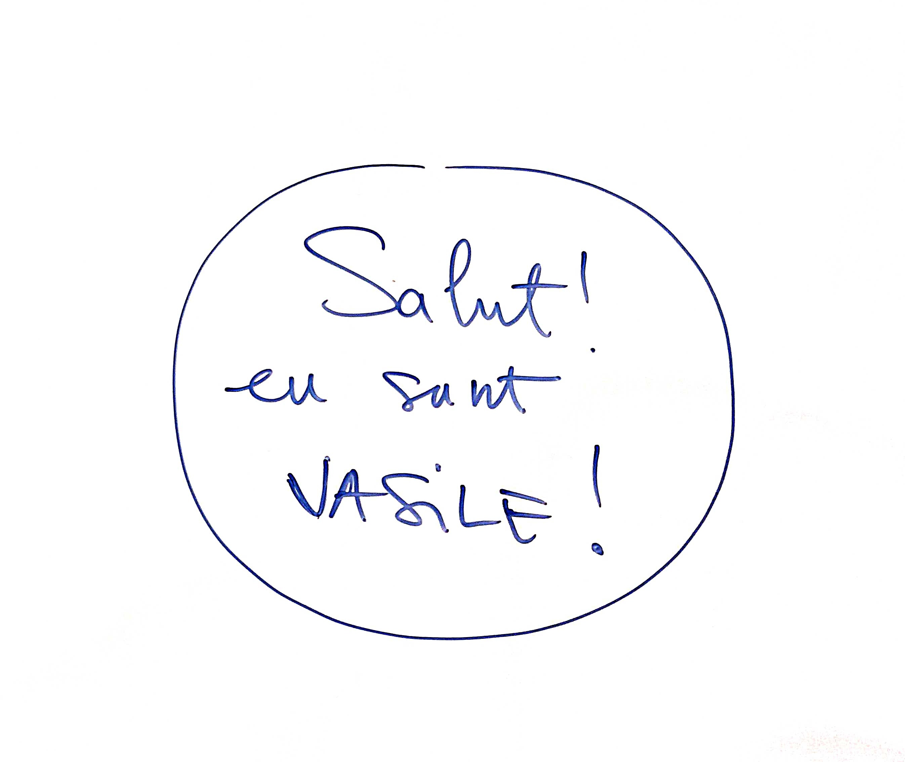
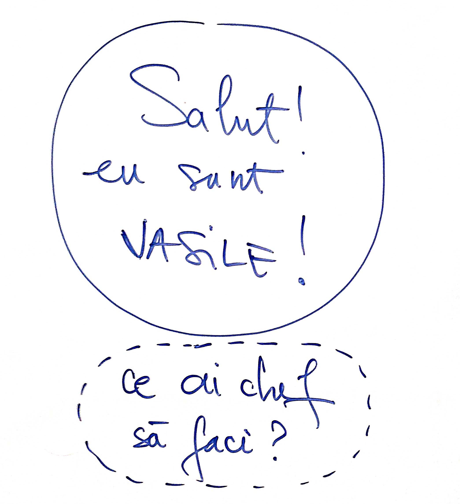
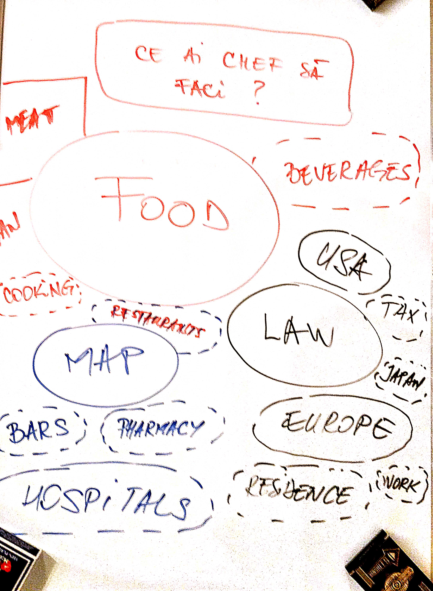
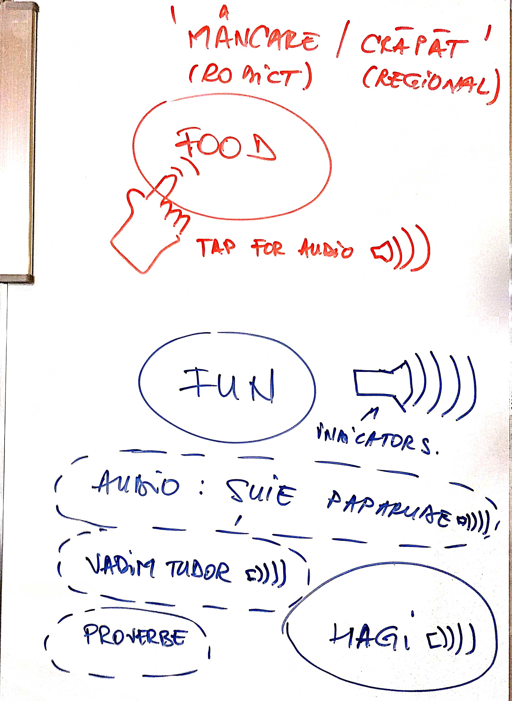

# Detalii tehnice

## Ecrane aplicatie

### Buna, eu sunt Vasile!
* *What would you like to do?* (Ce ti-ar placea sa facem?)
  * Mancam ceva? (Food)
  * Ai nevoie de vreun act (hartoaga)? (Law)
  * Cauti un loc? (Map)
  * Invata (Fun)

#### Activitatea centrala - explorare
* Food (Mancare) - 25%
  * Carne - 20%
  * Vegan - 20%
  * Branzeturi - 20%
  * Fructe - 20%
  * Bauturi - 10%
    * Alcool - 30%
    * Cafea - 60%
    * Ceai - 10%
  * Specific - 10%
    * Italian - 50%
    * Chinezesc - 25%
    * Indian - 15%
    * Romanesc - 10%
      * Mici - 99%
      * Sarmale - 1%
* Law (Law) - 25%
  * Taxe - 40%
  * Parcari - 20%
  * Rezidente - 20%
  * Contracte de munca - 20%
* Map (Harta) - 25%
  * Standard Google map screen
  * bule in jurul locatiilor de interes pentru user

#### Distractie
* Fun (Distractie) - 25%
  * Proverbe romanesti: https://vorbeste-romaneste.ro/ - 50%
  * Citate de romani ‘celebri’: https://www.youtube.com/watch?v=7VVcmcAErYk - 30%
    * Inventatori romani - 50%
    * Dume romanesti - 49%
    * Vadim Tudor in audio original zicand 'adu telefonul incoace' - 1%
  * Voci romanesti celebre
    * Exarhu
    * Toma Caragiu
    * Horatiu Malaele etc.
* _Tap pe fiecare buton de categorie actualizeaza ecranul principal_

## Detalii tehnice

* P0: Butoane ‘bule’ - cu text in limba userului (engleza), la tap cu audio, si cu text schimbat in limba locala (romana)
* P1: Procentele din mock-uri pentru categorii sunt statice, insa in viitor pot contine un AI
  * Preferabil sa adaugam procesatorul de procente sa foloseasca YAML-uri (utilizabile in Python / Javascript)
* P1: Orase suportate in prototip:
  * Bucuresti, Romania
  * Chisinau, Republica Moldova
* P1: i18n in prototip:
  * Limba utilizator: P0 engleza, P1 romana
  * Limba locala: P0 romana, P1 romana dialect regional (Banat, Moldova, Ardeal, etc.), P1 rusa

## ROXANA Neagu: > ar fi interesant pt expati, dpdv legislatie, tot ce tine de:
* rezidenta fiscala & relatia cu autoritatile fiscale (plata taxelor&impozitelor)
* inmatriculari de vehicule in romania
* asigurari sociale si de sanatate
* zona de relatii de munca (daca sunt angajati)
* sau regimul fiscal al freelancerilor - in cazul in care lucreaza pe cont propriu ca PFA/SRL -
* cu tot ce presupune fiecare dintre variantele astea:
* depunere de declaratii fiscale
* raportari la ANAF
* plati de taxe

## REMUS Popovici: Legal pentru expati 101

1. Aflarea termenului si modului legal de a sta In Romania, sunt 4 categorii:
  * Cetateni europeni - pot sta oricat, doar ca trebuie sa se inregistreze la IGI, procedura este relativ simpla chiar daca nu ai niciun motiv, doar mijloace de intretinere
  * Membrii de familie cetateni romani/UE - prinre cele mai simple permiae de sedere, dar trebuie sa iei permis sedere IGI
  * Cetateni USA, CANADA, JAPONIA - poti obtine un permis sedere simplu, cu o simpla societate pt activitati comerciale
  * Cetateni non-UE - se obtin permiae de sedere mai greu, in special pt scopuri de munca (trebuie sa.faci societate si sa te angajezi)
2. Dupa alegere motiv drept sedere, trebuie obtinuta viza de intrare in Romania (anumiti cetateni nu au nevoie)
3. După venirea in Romania trebuie permis de sedere, in majoritatea cazurilor este nevoie de contract de.inchiriere.
  * Mereu a se cere contract in engleza
  * Mereu se citeste contractul
  * Mereu se solicita inregistrarea la ANAF
4. Dupa se obtine permis sedere
5. Ulterior, se poate cumpara masina, se inregistreaza la DITL si apoi la DRPCIV
6. Daca se sta pe termen lung in Romania este recomandat obtinere permis conducere roman
7. Daca se sta peste 183 zile in Romania, se solicita stabilirea rezidentei fiscale in Romania (se platesc taxe in RO pt toate veniturile, inclusiv din afara Ro, si se aplica tratate de evitare dubla impunere)
8. Se reinoieste din timp permisul de sedere/certificatul de înregistrare
9. Dupa 5 ani se aplica pt rezidenta permanenta
10. Dupa 8 ani se poate aplica pt cetatenie romana.

